# Conflux - Toplantı Uygulaması

### Github repository'sinin [Linki](https://github.com/Morteza-Rezaei/conflux_meeting_app)

## Apk Dosyası ve Uygulamanın Videosu

- apk dosyasını [buradan](https://drive.google.com/file/d/1GEXCcpyzEssht1AOcmMy_1aQRmqLmOWI/view?usp=drive_link) indirebilirsiniz.
- videosunu [buradan](https://www.youtube.com/watch?v=SpAY46ZTj8U) izleyebilirsiniz.
# Flutter Kurulumu

Bu proje Flutter ile geliştirilmiştir. Projeyi çalıştırmak için aşağıdaki adımları izleyin:

## 1. Flutter SDK'nın İndirilmesi ve Kurulumu

Flutter'ı  işletim sisteminize kurmak için [resmi Flutter websitesini ziyaret edin](https://docs.flutter.dev/get-started/install) ve aşağıdaki adımları izleyin:

- **SDK'nın İndirilmesi**: Flutter SDK'nın en son sürümünü indirin.
- **ZIP Dosyasının Çıkarılması**: İndirdiğiniz dosyayı bir klasöre çıkarın.
- **Path Ayarları**: Sistem değişkenlerine Flutter'ın `bin` klasörünü ekleyin.

## 2. Gerekli Paketlerin Yüklenmesi

Proje klasörünüzde terminali açın ve aşağıdaki komutu girin:

```bash
flutter pub get
```

## Nasıl Kullanılır

### Olası Toplantı Oluşturma

1. Uygulamaya giriş yapın.
2. "Olası Toplantı Oluştur" butonuna tıklayın.
3. Başlık, açıklama, süre (dakika olarak), olası tarihler ve katılımcıları ekleyin.
4. Bilgileri kaydedin.
5. Oluşturulan olası toplantı için uygulama bir şifre üretecek, bu şifreyi kopyalayın ve paylaşın.
<div style="display: flex; flex-wrap: nowrap;">
  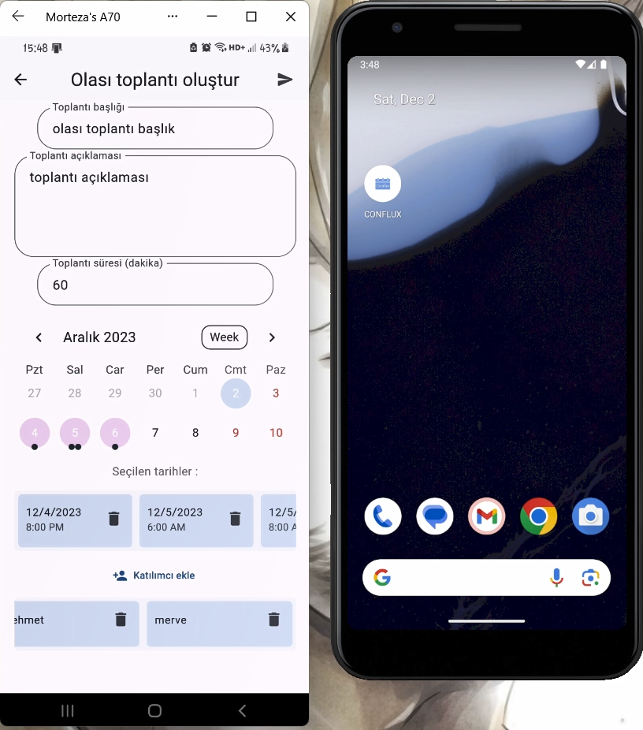
  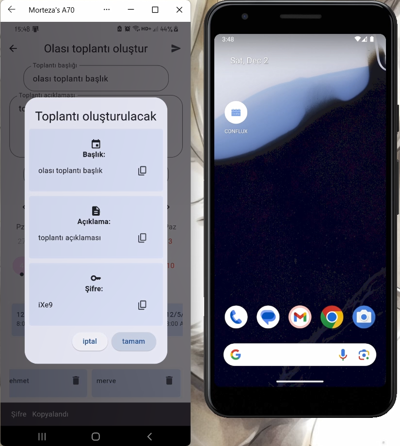
</div>

### Olası Toplantıyı Görüntüleme ve Tarih Seçme

1. "Olası Toplantıyı Görüntüle" butonuna tıklayın."Olası Toplantıyı Görüntüle" butonuna tıklayın.
2. Katılımcı ismi ve paylaşılan şifreyi girin.
3. Doğru bilgi girilirse, bir başka ekrana yönlendirilirsiniz.
4. Bu ekranda, toplantı bilgilerini sayfasını görüntüleyebilir ve uygun tarihleri seçebilirsiniz. veya Diğer kullanıcıların seçtiği tarihleri gösteren sayfaya gidebilirsiniz.
<div style="display: flex; flex-wrap: nowrap;">
  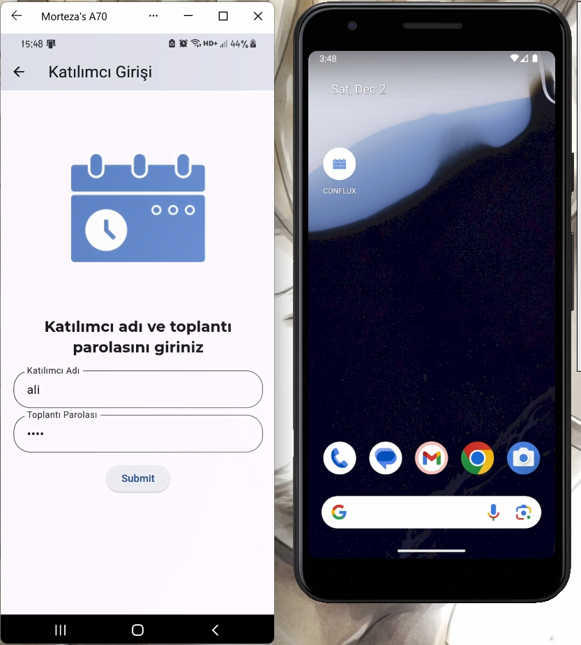
  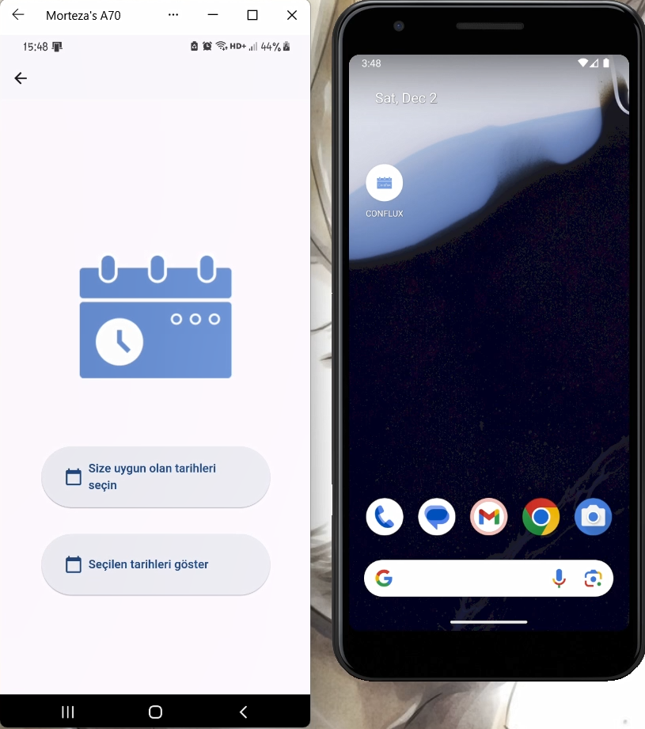
</div>
<div style="display: flex; flex-wrap: nowrap;">
  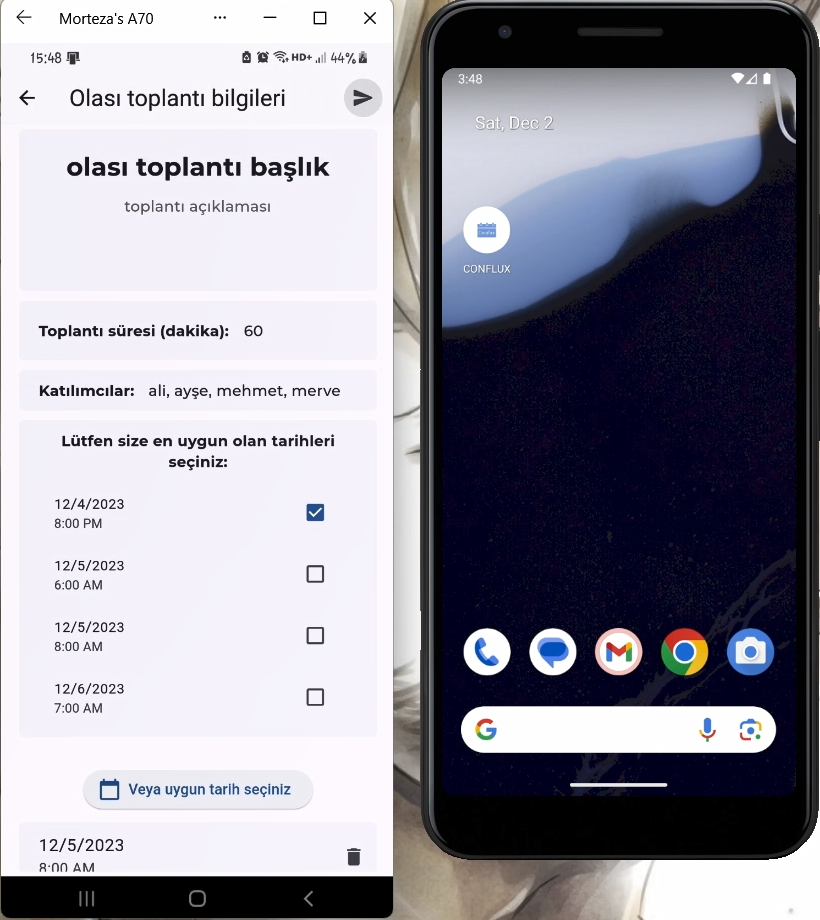
  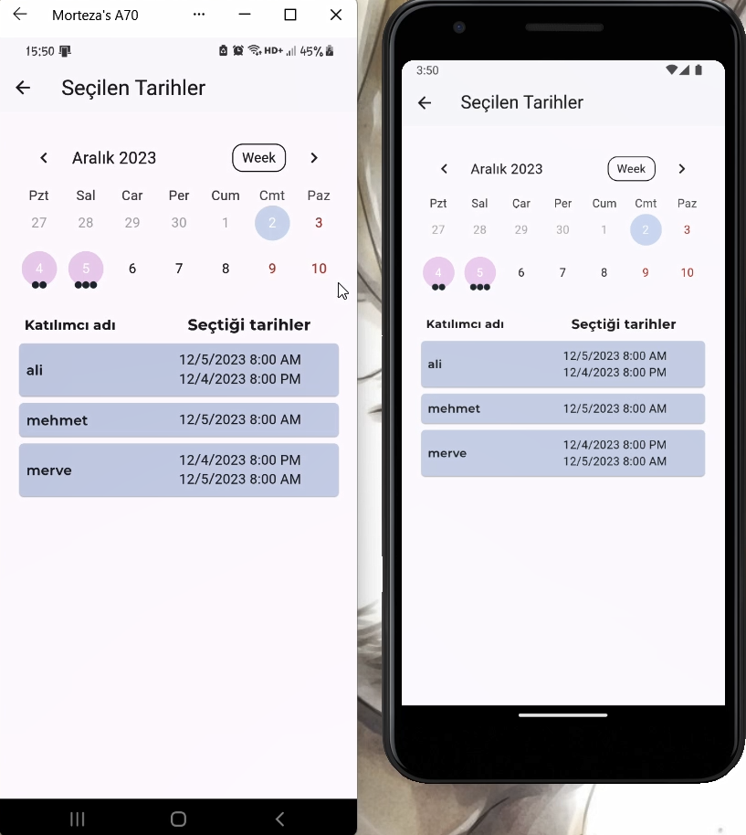
</div>

### Kesinleşmiş Toplantı Oluşturma

1. "Toplantı Oluştur" butonuna tıklayın.
2. Başlık, açıklama, süre (dakika olarak), en uygun tarihi ve katılımcıları ekleyin.
3. Bilgileri kaydedin.
4. Oluşturulan toplantı için uygulama bir şifre üretecek, bu şifreyi kopyalayın ve paylaşın.
<div style="display: flex; flex-wrap: nowrap;">
  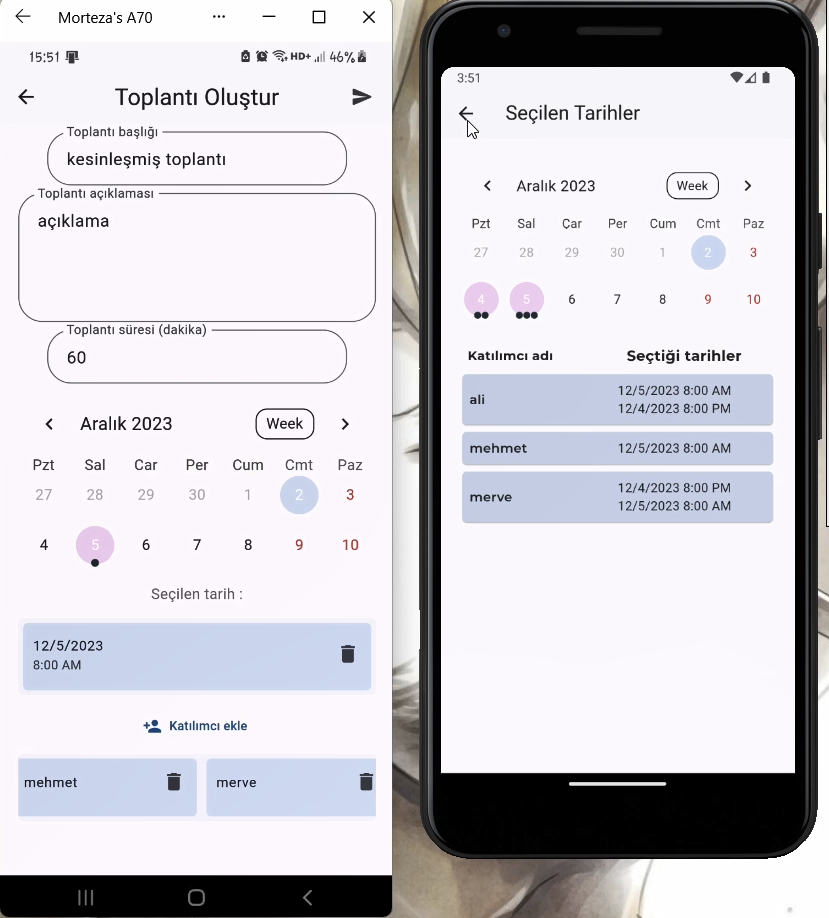
  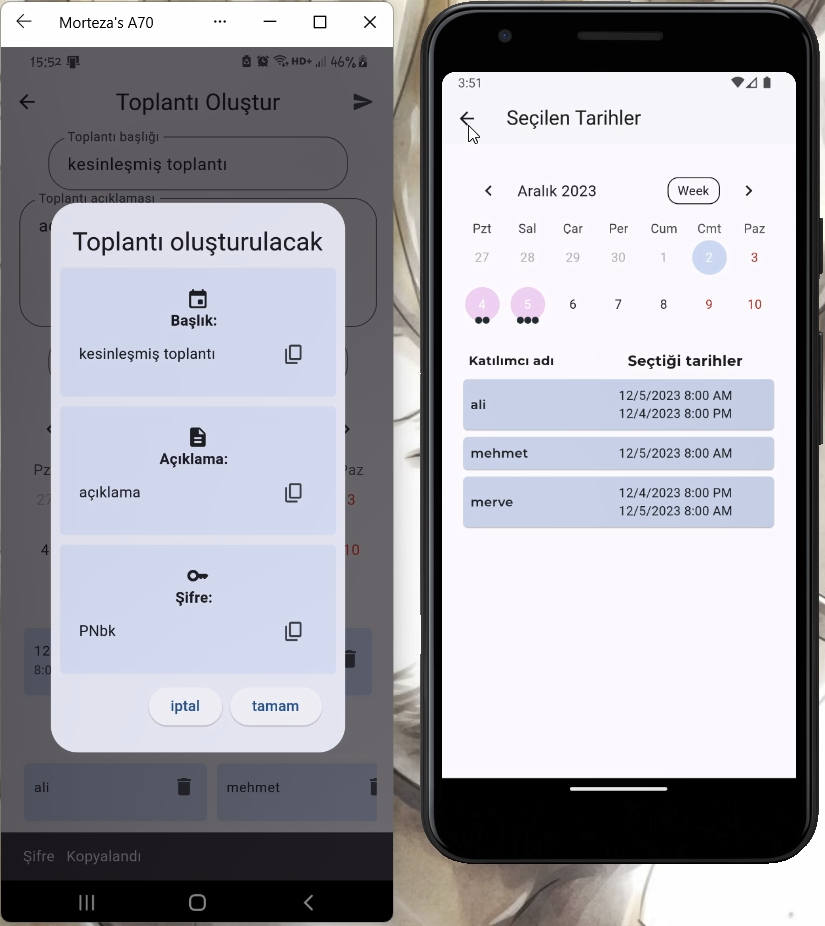
</div>

### Kesinleşmiş Toplantıyı Görüntüleme

1. "Toplantıyı Görüntüle" butonuna tıklayın.
2. Katılımcı ismi ve paylaşılan şifreyi girin.
3. Doğru bilgi girilirse, bir başka ekrana yönlendirilirsiniz.
4. Bu ekranda, toplantı bilgilerini görebilirsiniz.
5. "Takvime Ekle" butonuna tıklayarak, toplantıyı Takviminize ekleyebilirsiniz.
<div style="display: flex; flex-wrap: nowrap;">
  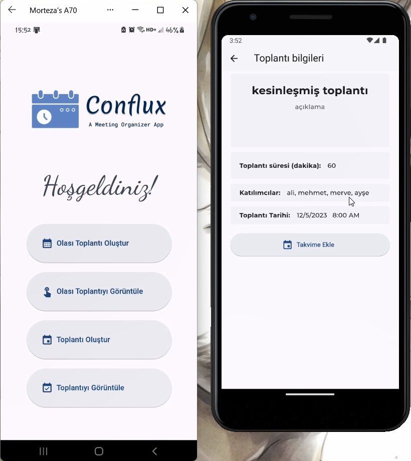
  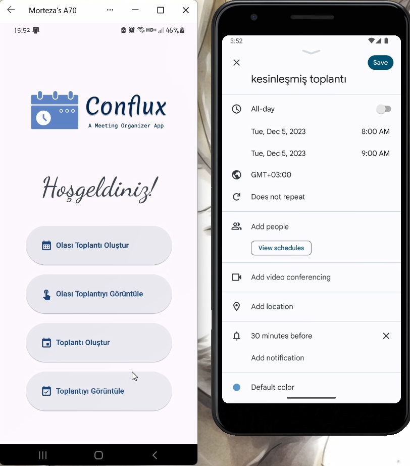
</div>
<div style="display: flex; flex-wrap: nowrap;">
  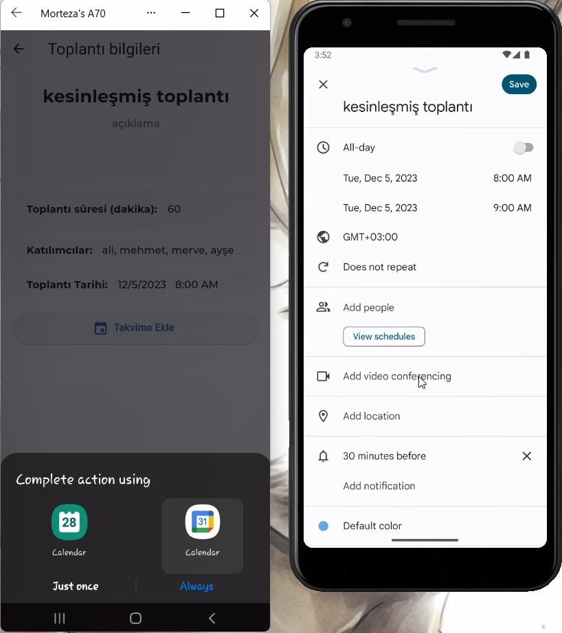
  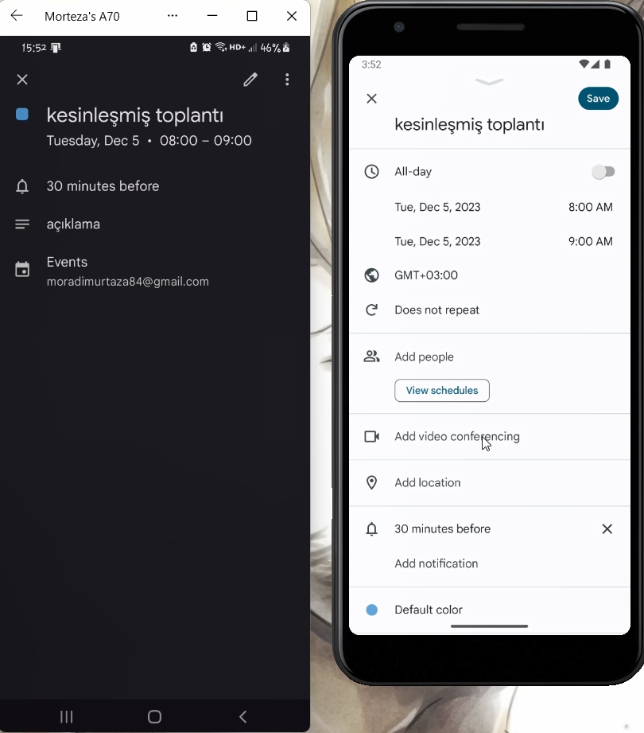
</div>
